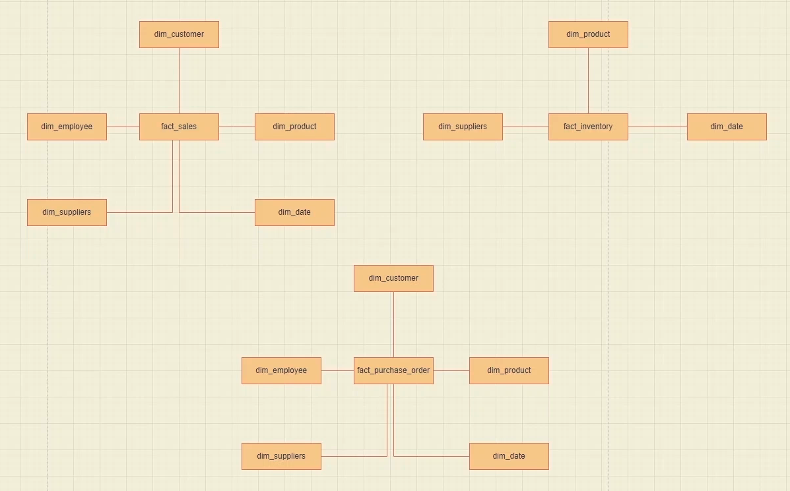
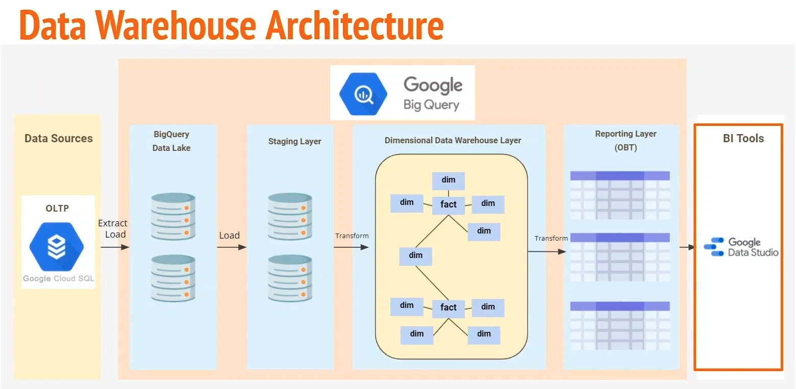

# Analytics engineering bootcamp
Welcome to the practical part of the analytics engineering bootcamp.
In this hands-on tutorial, we will build dimensional datawarehouse for northwind leveraging hybrid methodology. We will use real-world scenario and data to build dimensional models and practice various use cases, demonstrating the importance of data modelling for efficient data processing, analysis, and reporting. This tutorial will equip you with the skills and knowledge to model data effectively and drive business insights from your data.

### Set up BigQuery:

- Go to Google and create a Google account if you don't already have one.
- Create a new project for your hands-on tutorial. Give your project a unique name and update your Project ID.
- Once the project creation is completed, select the project that you recently created.
- Go to BigQuery.
- Create a dataset by selecting your project, giving the dataset an ID (DL_North_Wind), and selecting where you want to store data (europe-west3).
- To create the necessary tables for the tutorial, copy and paste scripts from the analytics-eng-bootcamp/dl_northwind_sql into a Google BigQuery editor and run them. These scripts will create empty tables, which we will then be populated with data.
Here are the steps to set up a Git repository:

### Set up Version Control:
```shell
mkdir analytics_engineering
git@github.com:TolgoAI/analytics-eng-bootcamp.git
```
### Set up DBT

1. First, make sure you have Python 3 installed on your machine. You can check your Python version by running the command `python --version`.

2. Open your terminal and run the following command to install dbt core with BigQuery provider using pip:
```shell
   pip install dbt-bigquery
```
3. Once the installation is complete, you can verify that dbt is installed correctly by running the command:
```shell
   dbt --version
```
This should display the version number of dbt that was installed.

4. To configure BigQuery credentials for dbt, you can create a file called `profiles.yml` in your `~/.dbt/` directory. Here's an example `profiles.yml` file with BigQuery credentials:

```
 analytics_bootcamp:
  outputs:
    dev:
      dataset: dbt_dataset
      job_execution_timeout_seconds: 300
      job_retries: 1
      location: EU
      method: oauth
      priority: interactive
      project: ae-bootcamp-t
      threads: 1
      type: bigquery
  target: de
```
For debugging and information on configuring dbt with BigQuery, check out the dbt documentation: https://docs.getdbt.com/docs/profile-bigquery
### Build Dimensional Model on BigQuery
Building a data warehouse involve understanding the use case, gathering requirements, defining the architectural design, creating a dimensional model, developing transformation code, and creating a physical dimensional model.
1. *Identify* and understand the use case: The first step in building a data warehouse is to identify and understand the use case. This involves understanding the business problem that the data warehouse is intended to solve, as well as the data sources and data requirements needed to support the use case.

2. *Gather requirements*: Once the use case has been identified, the next step is to gather requirements. This involves working closely with stakeholders to understand their business requirements and what they are trying to achieve. This includes defining the scope of the data warehouse, the data sources that will be used, and the specific data requirements needed to support the business objectives.

3. *Define architectural design*: Once the requirements have been gathered, the next step is to define the architectural design. This involves determining the overall structure of the data warehouse, including the types of data models that will be used, the data sources that will be integrated, and the overall data flow and processing requirements.

4. *Create a dimensional model*: After the architectural design has been defined, the next step is to create a high-level model of a dimensional model. This involves using tools such as ER diagrams to create a logical data model that describes the relationships between the data entities and the attributes of those entities.

5. *Develop transformation code*: Once the dimensional model has been created, the next step is to develop transformation code. This involves using SQL to transform the raw data into the format required by the dimensional model. This can involve cleaning the data, joining data from multiple sources, and aggregating data as needed.

6. *Create physical dimensional model*: After the transformation code has been developed, the next step is to create a physical dimensional model. This involves creating the actual tables and relationships needed to store the data in the dimensional model. This can involve creating staging tables, fact tables, dimension tables, and other supporting tables as needed.

### Use case presentation
The purpose of the use case is to modernize the data and reporting solution of a company called Northwind Traders, which is a specialty food trading company. They currently use a mix of on-premise and legacy systems, with a MYSQL database for transactional and reporting purposes. However, this has led to slow reporting and scalability issues, which prompted the company to seek a new solution. The aim is to phase out the on-premise solution and migrate to the Google Cloud platform, using Google Managed Services Cloud Sequel and building a Dimensional Data Warehouse on BigQuery. The main focus of the hands-on tutorial will be building the dimensional data warehouse.
### Requirement gathering:
The requirement gathering stage involves defining business processes, conducting data profiling to understand the data, creating a buzz matrix and naming convention document, and developing a conceptual model for communication. The output of this stage is a conceptual model. During interviews with business and stakeholders, reporting requirements were identified, including sales overview, sales agent tracking reports, product inventory report, and customer reporting. These reports will help the business make data-driven decisions and improve sales, inventory, and marketing.
### Data profiling:
Data profiling is an essential process in understanding the system and data. It helps to identify data redundancies, the complexity of the data, and the relationship between tables. By doing so, it will help to form the conceptual model and speed up the design solution. The following steps can be taken to perform data profiling in BigQuery:

- Start by looking at BigQuery tables.
- Examine the tables, their relationships, and their schema to understand the data.
- Check the correctness of the data types of the tables and make a note of any potential problems.
- Look at the details column of the tables to see the number of rows available.
- Preview the data to give it a quick scan and make notes of anything that might be helpful in understanding the data.

We will conduct data profiling by writing simple queries.
### Workbook walkthrough

A workbook has been created as a blueprint for the hands-on tutorial, with multiple tabs and columns grouped by color code.
Here are step-by-step instructions for using the Engineer Bootcamp workbook:

Access the workbook by navigating to analytics-engineering-bootcamp-workbook/Analytics Engineering Bootcamp - Excel.xlsx

The workbook is organized into three tabs: "template", "hands-on", and "completed". The first tab is a template that you can use to create your own bus matrix, while the second tab is where you will complete the tutorial exercises.

Start by focusing on the "Bus Matrix High Level Entities" section, which is located in the "Hands-On Tutorial" tab. This section contains several columns, each of which is color-coded for easy reference.

Throughout the tutorial, you will be going through various steps. The Analytivs Engineering Bootcamp workbook is a critical document that you will keep coming back to and using as a reference.

As you work through the tutorial exercises, you can refer to the "Completed" tab to see what the final expected result should look like.

Use the provided tabs to create your own bus matrix, and complete the tutorial exercises in the "Hands-On Tutorial" tab.

Once you have completed the exercises,review your work. You can use the "Completed" tab to check your results and make sure that you have understood everything correctly.

### Create a bus matrix
In order to create a bus matrix, we need to identify high-level entities for all the four business processes. The first process is the Sales Overview Report. Before creating the matrix, we need to review the sales overview requirements and highlight the keywords, such as sales customers, products, and transactions. Based on this, we create a table with a business process as a column and high-level entities as rows. For the Sales Overview Report, we need the orders table containing quantity and transactions, customer and employee tables, and some supply information. We also require a date dimension to create reports like last seven days last month and last quarter sales. Once we have marked all these requirements, we have successfully completed the bus matrix for Sales Overview.

The next process is Sales Agent Tracking, where we need to identify the dimensions based on the keywords, such as sales performance and sales agent. As the main purpose of this report is to identify high achievers, we need to know about employees, sales performance, and customers. Therefore, we need all these dimensions marked in our bus matrix.

After completing the bus matrix for these two processes, we get an idea of what to do next. In reality, we would create a workbook with all the details and use it as a reference throughout the project. An analytics engineering bootcamp workbook is available for this purpose, containing everything covered in this hands-on tutorial. We have various tabs in the workbook, including the bus matrix high-level entities tab. The workbook is organized in three different tabs, including a template, a tab for hands-on work, and a completed tab.

Overall, the bus matrix helps us identify the high-level entities required to build our business processes, and it is an essential step in building a dimensional data warehouse.

### Build a conceptual model
Now that we have our bus matrix, we can proceed to build our conceptual model, which will help us communicate our model back to the business and show them what it will look like.

When we examine our bus matrix, we can identify three distinct business processes: sales, inventory, and customer reporting. However, it's actually more related to understanding purchase orders. Let's confirm a few things in our BigQuery data warehouse table.

Regarding sales processes and transactions, they are contained in our order_details and order tables. The order_details table contains all the information on the quantity, unit_prices, and associated discounts. If we look at our order table, we'll find all the information that we can map back to our customers and employees. Then we have inventory, and if we examine our inventory transaction table, we'll find all the transaction information associated with that inventory. Lastly, we have purchase_orders, which we previously looked at. The same goes for purchase_order_details, and these are our fact tables.

This is a high-level conceptual assumption that we are making based on our understanding of the table, the schema, and the ERD model that we previously examined.


### Understand the architecture design
Now that we have built our high-level bus matrix and conceptual model, it's time to look at the architectural design. The data team has already migrated our on-prem Microsoft SQL solution to Google Cloud SQL, and this data is loaded into the big data lake layer in the form of S3 data. Our data lake is essentially a replication of our data sources so that we don't query our data sources directly. We have a layer in between where we can materialize our old data, which reduces the load on our transactional data-based systems. The data is then loaded to a staging layer where we will do some data transformations and cleansing. Once our data is available in the dimensional data warehouse layer, we create a Dem and fact model. We create one big table to speed up reporting and showcase how we would use different modeling styles in combination to build such solutions.



Now that we understand what our architecture looks like, we can start our dimensional modeling process.

Previously, we completed building both high-level matrix entities and a conceptual model. The next step is to use all of this content to continue building our process of dimensional modeling. Let's start our dimensional modeling process. We will follow four steps to create our dimensional model once this process is completed. We should have our bus matrix with granularity defined based on this. We will then create a logical model and a source-to-target document.

The first step is to select the business process. The second step is to declare the grain. The third step is to identify the dimensions and then identify the facts.

Here we have our bus matrix again(analytics-engineering-bootcamp-workbook/~$Analytics Engineering Bootcamp - Excel.xlsx). However, you may have noticed that there are a couple of extra columns compared to what we had before. We also have another column called "Priority." These priorities are defined by our business based on which reports would bring the highest value to the business first. If you remember from our previous exercise when we built our final Bus Matrix High-Level entities, we mentioned that we would be taking this back to the business to discuss which reports to build first. The outcome of that process is what we are seeing here. We discussed with the business and defined the priorities we can see. The sales overview has high priority, customer reporting has high priority, sales agent has medium priority, and product inventory has the lowest priority of all.

As the next step, we will complete this bus matrix by identifying granularity, facts, and the dim details. In order to do that, we will need to use our analytics engineering workbook and go to the Bus Matrix tab.

We are now back in our workbook and have selected the detailed bus matrix template. This template has the same columns as before, but they are empty so that you can copy it and create your own version.

I have already completed this step and created a new tab called Bus Matrix Detailed. Here, you'll see all the headers, the correct column names, and the high-level entities that we built during our conceptual model. I have also listed their priorities.

As the next step, I want to choose the business process we have deemed as the highest priority. Let's select that.

Now, we need to define our effect table and the granularity of those fact tables. We know that Sales Overview affected sales previously, so let's name that as our fact table.

There are three different types of fact tables: transaction, periodic, and accumulative. Fact Times have been explained in detail in Section 7. Our base or core fact table should be transaction granularity so that we can store a more granular level of detail.

Granularity is slightly tricky as we need to do a bit of discovery and data profiling. We know that we're looking for purchase of our products and transaction-related data. We have orders and order details. If we look at our order details table, we can see that it contains information about purchases of products and contains unit price, quantity, and discounts. These are all relevant information we need to define our granularity.

So let's go back to our workbook and put our granularity as one row per order details line item.

As a next step, we need to double-check if the dimensions that we selected during our conceptual model are all correct. It is usually a good idea to double-check dimension tables against our entity relationship diagram. Going back to our ER diagram, we can see that our customers and employees all have a one-to-many relationship to orders. Orders have a one-to-many relationship to our order details. So logically, this makes sense because if we create our fact table using all the details and orders, we should be able to connect the rest of our dimension tables, which are customers, employees, products, and suppliers.

Next, let's verify this by writing some queries to double-check if our assumption is correct. We'll need to go back to our bakery and write some queries. Let's open a new tab.

What we want to do is to create a join between order details and product first to identify if all the orders can be associated with the products table. We'll write our query in BigQuery like this:
```sql
SELECT p.product_name,
      count(od.product_id),
      sum(od.quantity)
FROM `rp-analytic-engineer-bootcamp.dl_northwind.order_details`od
JOIN `rp-analytic-engineer-bootcamp.dl_northwind.products`p
ON p.id = od.product.id
group by 1;
```
We'll just do some calculations and counting up the product ID. The result here indicates the total count for each product and the costs associated with each product. Each row here represents the sale of a product.

Let's try one more query to validate that all the dimensions we have selected are correct. This time, we want to find out if we can join between our order_details table and our customer table. We'll write a query which looks like this, very similar to what we've done previously:

```sql
SELECT c.first_name,
      sum(od.quantity),
FROM `rp-analytic-engineer-bootcamp.dl_northwind.order_details`od
JOIN `rp-analytic-engineer-bootcamp.dl_northwind.customer`c
ON c.id = od.customer_id
group by 1;
```
Here we can see that the customer_id is not found inside the order details. If we go back to our ERD(Cloud-SQL-OLTP-ERD/northwind-oltp-erd.png) and look at the order_details, we will notice that it only contains product_id. We need to bring in our orders_table because this is where our customer ID is. Once we bring in this order information within order details, we can create one fact table and then access customer information, employee information, shipper information, and everything else from here.

Currently, we have `order_details` that need to be joined with the `orders` table using a left join on orders. The query for the join looks something like this:
```sql
SELECT c.first_name,
      sum(od.quantity)
FROM `rp-analytic-engineer-bootcamp.dl_northwind.order_details`od
LEFT JOIN `rp-analytic-engineer-bootcamp.dl_northwind.orders`o
ON o.id = od.order_id
LEFT JOIN `rp-analytic-engineer-bootcamp.dl_northwind.customer`c
ON c.id = o.customer_id
group by 1
```
The query shows that we only have a total of 15 customers, whereas we know we have 30 customers in our customer table. This raises the question of why we have only 15 records in the orders table. After investigating, we discover that out of 30 customers, only 15 of them have placed an order recently. This is fine, as we have enough understanding of the relationship between these tables, and we can confirm that the dimension tables we have selected are suitable.

The next step is to identify dimensions and facts for our dimensional modeling. This means we need to provide more information about our facts and dimensions. The bus matrix gives us a high-level understanding of what we need to do and how we need to build the table. However, when we actually build the table, we need to understand what columns we need to use for each fact table and dimension table. Instead of defining these details in the bus matrix, we prefer to include them in the source-to-target mapping document.

The source-to-target mapping document will become our main reference document between developers, and it will be critical for us to use during the physical implementation phase. As part of the source-to-target mapping document, we will also produce a Dimensional Model Attributes and Measures Document, which will provide a more detailed breakdown of fact and dimension tables. This document will be essential for anyone else looking at this document to know where to go and reference for more detailed information about our fact and dimension tables.

### Source to target mapping
Next, let's create a source-to-target mapping document so we can understand how to do so.

To target mapping:
So we need to create source-to-target documents:

- OLTP(Cloud SQL) --> to data lake
- Data lake --> staging layer
- Staging layer --> warehouse
- Warehouse --> OBT


Let's start by creating a source-to-target document for our Cloud SQL to data lake. If you have been following this hands-on tutorial so far, you would have the data lake table created by now. If not, please refer to the "Set up BigQuery" section to see how to populate this dataset and tables.

Looking at the tabs here in the workbook, we have:

- Source-to-target mapping data lake
- Sales to target mapping staging layer
- Dimensional model attributes and measures, which is going to be part of the source-to-target mapping warehouse
- Source-to-target mapping for analytic layer or one big table.

The structure of this document is exactly the same as how we've been going through the bus matrix. We have the template as the first document, and then we have the second document here, we have the second step, which is a copy of this where I will be taking you through the details,dnd then we have the completed version for a reference documentation.

So first of all, what is source-to-target mapping? It basically allows us to understand where the data is coming from and what it will become once it lands at its destination. Because during each transfer of data, data transformation can happen, and we need to keep track of all of these transformations. This source-to-target mapping document is very important for us to use it as a reference point during our build phase.

Looking at this template, we have target on the left side, source on the right side. This is because when we actually build tables, it is helpful to see the targets first. This is why they are on the left side.

Easiest way is to start this by looking at our BigQuery table. This data lake dataset, as we mentioned previously, is a replication of what would be in OLTP database or cloud SQL database.

So what do we do next? How do we populate this? Let's go back to our BigQuery.

So first of all, let's start by looking at our customer table. Since this is a representation of our ERD, which is exactly the same column names, but inside our BigQuery table, this makes our process a bit easier. And we are doing this because if we look at the schema, we can see all the columns that we need.

Once we have copied and pasted it, let's do a little bit of cleanup. We'll get rid of all the bodies, which we don't need. Again, we know that all of these columns here are an exact replication of OLTP. So what we need to do is to just copy the source columns and paste to a target part.

Next, we will move on to the next section of the document, which is the "sales to target mapping for staging layer". This section will cover the mapping of the data from the data lake to the staging layer.

Similar to the previous section, we will start with the template and then fill in the necessary details. The target table for this section is the staging layer, and we will need to reference the architecture diagram again to understand how the data flows from the data lake to the staging layer.

We will populate the target column name, target table name, data type, target schema, target system, and any additional notes. We will then move on to the source section and populate the source column name, source table name, data type, and any additional notes.

We will continue this process for each section of the document, including the dimensional model attributes and measures, and the source to target mapping for the analytical layer or one big table.

Once we have completed all of the sections, we will have a comprehensive source to target mapping document that will serve as a reference point during the build phase. This document will help us understand where the data is coming from and what it will become once it lands at its destination.

### Logical Model (expand it and attach a logical diagram)
Before proceeding with building a physical model, we should build a logical model using a bus matrix, starting with the fact tables and their associated dimensions. The process involves creating an entity relationship between fact and dimension tables.

### Physical design and development

We are going to be creating our physical design model and the development of our dimensional data warehouse.

So let's have a look at how we will do that first.

First, we all need to create a physical model. Then we'll use our source to target document that we created previously as our reference point to set up our data warehouse. During this phase, we will be using DBT as our main data transformation tool. We will be creating our data warehouse layer, our data warehouse table, and we will populate those tables using SQL.

So first, let's create our physical model.

To do that, we all need to go back to our draw.io Now we are at draw.io, let's create a new tab, and we'll call this tab physical. And let's change our style so it's the same as our previous ones. And let's go back to a logical model very quickly.

In this logical model design, the first thing we would notice is how the tables are replicated across our fact tables. We can see the demo date here is replicated in our effect inventory for sale. And then again, in our fact purchase order. Same thing goes for dim product, dim customer, dim employee. All of these dimensions are shared across multiple facts. So what we can do in this case is to create a conformed dimension. This is what we would be doing in our physical design. We would be creating a conformed dimension. Hence, creating a dimensional data warehouse will also improve our existing fact tables and dim table details. So we'll be adding data types and primary keys and foreign keys information to our design model. So let's do that.

Let's search here, entity from the options we have here. This time we will select the table designed to. Let's make a few changes here. We will add lane color, so we have a white background, which is much easier to read. And we'll name this table fact sales.

Next, what we need to do here is to add an additional column. In order for us to do that, let's go to arrange and down here in the table options section, we have an option to insert columns or to add rows. We want to insert columns to the right. So let's do that. Now our table has three columns. This is perfect. And we'll change our table design a little bit. So let's come over here, less like this row and let's remove this row. So that line that is now gone will make our design much more easier and readable. And as previously how we were designing our logical model, we'll have to fill in our table with all the information from our ecological model.

So if we go back to our logical model, we'll need to get all the information here that we did back to our physical design. So we'll do that for ID product and ID customer. We will also remove the underline here. And next, we need to add in the data types here as well. This is not complete, but let me just show you very quickly what we will be doing to complete this table.

So in order for us to do that, we'll need to go back to our workbook and then select ourselves to target mapping warehouse complete because this is where our final dim and fact table details are. So fact sales, we have all of this information here: integer, all the individuals here are integer quantities flowed. So what we all need to do is to transfer all of this information back to our model here, so we will do that now.

And here, I have completed our table with all the information that is necessary for our fact sales table. So you can see we have all the foreign keys and primary keys identified.

Now that we have created our physical design model and developed our dimensional data warehouse, we can move on to the next step, which is populating the tables using dbt (sql +jinja).

We will use the source to target document that we created previously as a reference point to set up our data warehouse. During this phase, we will use dbt as our main data transformation tool.

First, we will create staging layer,then our data warehouse table and OBT layers.

To create the data warehouse layer, we will use the conformed dimensions that we created earlier. This will improve our existing fact tables and dim tables details.

In order to populate our tables using SQL (in dbt), we will need to write SQL scripts for each of the tables that we created. These scripts will insert the data into the tables.Once we have written the SQL scripts, we will execute them to populate the tables.
